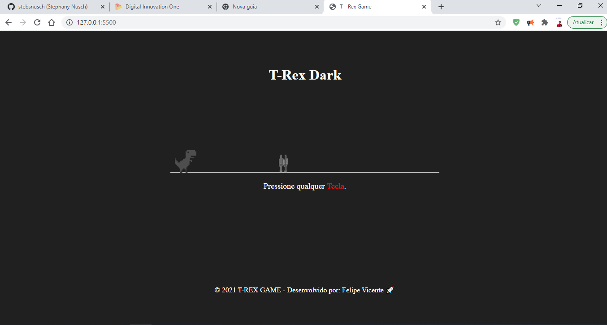

# Desafio Dino Game DIO 

T-rex game is an application developed based on the google dinosaur web game, with a dark and personalized theme, very fun and simple to play.

<h1 align="center">
    
</h1>

 

### The Project T-Rex Game
This will be an application DIO (digital innovation one) in this challenge Html, CSS e JavaScript concepts create an application to train what I have learned so far , a fun and simple game for everyone.
.

## 🧪 Technologies

Application developed using the following technologies:

- [HTML5](https://www.w3schools.com/html/default.asp)
- [CSS3](https://www.w3schools.com/css/default.asp)
- [JavaScript](https://developer.mozilla.org/pt-BR/docs/Web/JavaScript)

 
## 🚀 Getting started

### Requirements

Clone the project and access the folder.

## 📝 License

This project is licensed under the MIT License. See the [LICENSE](LICENSE.md) file for details.

---

Made with 💜 by Felipe Vicente👋
  

- ## My LinkedIn -  
